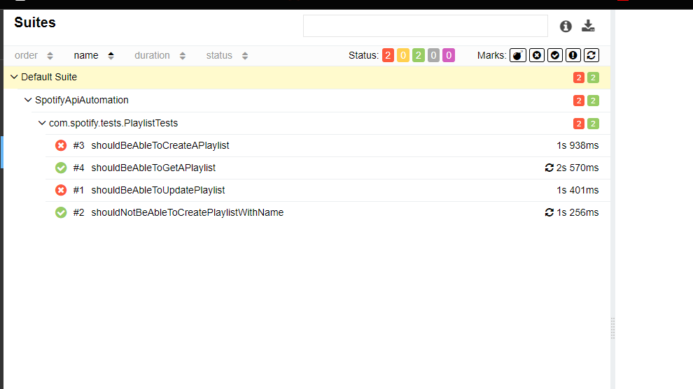

### Property Loader singleton desing pattern implementation:

```java
public class ConfigLoader {
 public  final Properties properties;
 private static ConfigLoader configLoader;
 private ConfigLoader(){
     properties = PropertyUtils.propertyLoader("/src/test/resources/config.properties");
 }

 public static ConfigLoader getInstance(){
     if(configLoader == null){
         configLoader = new ConfigLoader();
     }
     return configLoader;
 }

 public String getClientId(){
     String prop = properties.getProperty("client_id");
     if(prop!=null)return prop;
     else throw new RuntimeException("Client id is not specified in config.properties file");

 }

    public String getClientSecret(){
        String prop = properties.getProperty("client_secret");
        if(prop!=null)return prop;
        else throw new RuntimeException("Client secret is not specified in config.properties file");

    }


```

Now to fetch details frm the file use 
```java
ConfigLoader.getInstance().getClientId();
```

### Lombok Integration:
 * Add lombox dependency
```xml
 <dependency>
            <groupId>org.projectlombok</groupId>
            <artifactId>lombok</artifactId>
            <version>1.18.30</version>
            <scope>provided</scope>
        </dependency>
```
* Create your POJO class using Lombok’s @Builder annotation. For example:
  
```java
import lombok.Builder;
import lombok.Data;

@Data
@Builder
public class MyPojo {
private String view;
}
```
* To make a POST request using RestAssured, create an instance of your POJO using the Lombok builder pattern:

```java
MyPojo pojo = MyPojo.builder()
.view("some-value")
.build();

RestAssured.given()
.contentType(ContentType.JSON)
.body(pojo)
.post("your-api-endpoint");
```
---

### Integrating Allure Reporting
* Open windows shell and enter below commands to install allure report
```shell
Set-ExecutionPolicy -ExecutionPolicy RemoteSigned -Scope CurrentUser
Invoke-RestMethod -Uri https://get.scoop.sh | Invoke-Expression

scoop install allure

scoop --version

```
* Add dependency
  - add surefire plugin 
    ```xml
     <plugin>
                <groupId>org.apache.maven.plugins</groupId>
                <artifactId>maven-surefire-plugin</artifactId>
                <version>3.2.2</version>
                <configuration>
                    <parallel>methods</parallel>
                    <threadCount>10</threadCount>
                    <argLine>
                        -javaagent:"${settings.localRepository}/org/aspectj/aspectjweaver/${aspectj.version}/aspectjweaver-${aspectj.version}.jar"
                    </argLine>
                </configuration>
                <dependencies>
                    <dependency>
                        <groupId>org.aspectj</groupId>
                        <artifactId>aspectjweaver</artifactId>
                        <version>${aspectj.version}</version>
                    </dependency>
                </dependencies>
            </plugin>

    ```
  - add allure testng integration dependency
    ```xml
       <!-- https://mvnrepository.com/artifact/io.qameta.allure/allure-testng -->
     <dependency>
        <groupId>io.qameta.allure</groupId>
        <artifactId>allure-testng</artifactId>
        <version>2.27.0</version>
     </dependency>
    ```
    
* add allure project path
 Open command prompt and enter below command to store allure report 
```
   allure serve allure-result 
   // this command will create allure-result folder in project root directory and store results and show allure report on browser.
   
```
---
 ##### add display name to Testcase in report
  ```java
    @Test(Description="add your description")
  public void shouldBeAbleToCreatePlaylist(){
  
  }
```
 * Name will be displayed 
 

#### Add description 
Add @Description annotation from allure on method name
```java
import io.qameta.allure.Description;
import org.testng.annotations.Test;

public class TestMyWebsite {
    @Test
    @Description("This test attempts to log into the website using a login and a password. Fails if any error happens.\n\nNote that this test does not test 2-Factor Authentication.")
    public void testAuthentication() {
        // Your test logic here
    }
}
```

---
#### Add links 

1. **@Link**:</br>
The @Link annotation allows you to associate links with test cases, test steps, or other report elements in Allure.
You can use it to add plain links to external resources, such as documentation, external tools, or any custom URL.

```java
import io.qameta.allure.Link;
import org.testng.annotations.Test;

public class MyTest {
@Test
@Link("https://example.org")
public void myTestWithLink() {
// Your test logic here
}
}
```
In this example, the test case will have a link to “https://example.org” in the Allure report1.
2. **@Issue**:</br>
The @Issue annotation is used to link tests with specific issues or tickets (e.g., JIRA, GitHub issues).
You can specify the issue ID or key as the value of the annotation.

```java
import io.qameta.allure.Issue;
import org.testng.annotations.Test;

public class MyTest {
@Test
@Issue("AUTH-123")
public void testAuthentication() {
// Your test logic here
}
}
```
In this example, the test case is linked to the issue with ID “AUTH-123” in the Allure report2.
3. **@TmsLink**:</br>
The @TmsLink annotation is similar to @Issue but specifically for linking to test management system (TMS) entries (e.g., test cases in your TMS).
```java
import io.qameta.allure.TmsLink;
import org.testng.annotations.Test;

public class MyTest {
@Test
@TmsLink("TMS-456")
public void testAuthentication() {
// Your test logic here
}
}
```

---
#### Add behaviours

1. **@Epic:**</br>
The @Epic annotation allows you to categorize your tests at a high level based on business goals or major features.
It represents a large-scale business objective or theme.
For example, if you’re testing an e-commerce application, you might have epics like “User Authentication,” “Product Catalog,” or “Order Processing.”


```java
import io.qameta.allure.Epic;
import org.testng.annotations.Test;

public class MyTest {
@Test
@Epic("User Authentication")
public void testLogin() {
// Your test logic here
}
}
```
2. **@Feature:** </br>
The @Feature annotation is used to group related tests under a specific feature or functionality.
It represents a smaller, more focused aspect of the application.
Continuing with the e-commerce example, features could be “Login Screen,” “Product Search,” or “Checkout Process.”


```java
import io.qameta.allure.Feature;
import org.testng.annotations.Test;

public class MyTest {
@Test
@Feature("Login Screen")
public void testLogin() {
// Your test logic here
}
}
```
**@Story:**</br>
The @Story annotation further breaks down features into user stories or scenarios.
It represents a specific use case or interaction from an end-user perspective.
For instance, within the “Login Screen” feature, stories could be “Validating Email” or “Handling Invalid Credentials.”

```java
import io.qameta.allure.Story;
import org.testng.annotations.Test;

public class MyTest {
@Test
@Story("Validation")
public void testEmailValidation() {
// Your test logic here
}
}
```

---

**@Step :**</br>
The @Step annotation provides a way to break down your test logic into smaller steps, making it easier to understand what each part of the test does.
Steps can be used in various testing scenarios, including parametrized tests, checks, nested steps, and creating attachments.
Each step has a name that appears in the Allure report12.
Example Usage:
You can annotate any method (with any visibility modifier: public, private, or protected) with @Step.
For instance:
```java
import io.qameta.allure.Step;
import org.testng.annotations.Test;

public class MyTest {
@Test
public void myTestWithSteps() {

performLogin();
navigateToDashboard();
verifyUserDetails();
}

    @Step("Perform login")
    private void performLogin() {
        // Login steps
    }

    @Step("Navigate to dashboard")
    private void navigateToDashboard() {
        // Dashboard navigation steps
    }

    @Step("Verify user details")
    private void verifyUserDetails() {
        // Verification steps
    }
}

```

#### Add filter 
1. add allure-restassured dependancy in pom.xml file
```xml
 <!-- https://mvnrepository.com/artifact/io.qameta.allure/allure-rest-assured -->
        <dependency>
            <groupId>io.qameta.allure</groupId>
            <artifactId>allure-rest-assured</artifactId>
            <version>2.24.0</version>
        </dependency>
```

2. add this step in request and response specification :
```java
 .addFilter(new AllureRestAssured())
```
example:

```java

import io.qameta.allure.restassured.AllureRestAssured;

public static RequestSpecification getRequestSpec() {
    return new RequestSpecBuilder().
            setBaseUri("uri").
            setBasePath(BASE_PATH).
            setContentType(ContentType.JSON).
            addFilter(new AllureRestAssured()).//this step will add headers and request specs in allure report.
    log(LogDetail.ALL).
            build();
}
```
3. Similarly add response specification
```java

```

